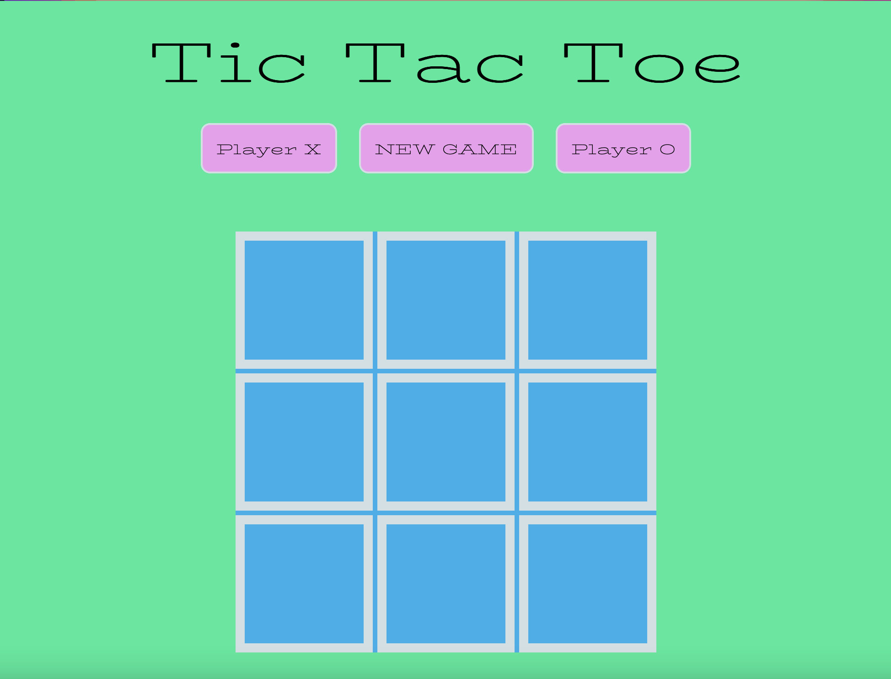

# Tic-Tac-Toe

https://crollo1.github.io/tic-tac-toe/ - Here, check out my game! This is my first project for GA, 2 weeks into the course. Enjoy!

• a general description of the project

• description of main features and any instructions on how to use them

• list of any known bugs

• tech used (JS, HTML, CSS - included media queries, jQuery)

• anything else you want to record about the project or the experience i.e next step tackling A.I etc, score keeping if I had more time, mouse hover being the current playing token

• a wishlist of any leftover features you'd like to add later
Better media query css function 

Check out this guide to writing a file in Markdown (.md) format, it's easy
You can even turn on a Markdown Preview mode from a .md file you're editing in VS Code with the shortcut cmd + shift + v  (or search for "markdown" in the Command Palette) - use split panel mode to see both the source file and the preview on the same screen and try out the markdown syntax interactively  :zap: (edited) winningMessage( pos0 );