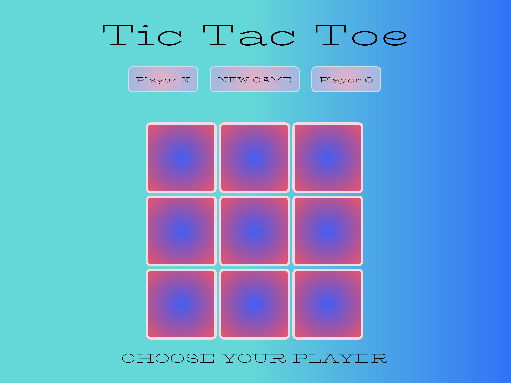

# Tic-Tac-Toe

Here, check out my game! This is my first project for GA, 2 weeks into the course. Enjoy!

https://crollo1.github.io/tic-tac-toe/

<em>Tic Tac Toe</em> - simple, fun and functional.

Instructions

1. First, click <strong>'New Game'</strong>
2. Select <strong>Player X or Player O </strong>and reveal the game board!
3. Winner will be announced with a fun feature - if it's a draw, you can try again!
4. Click New Game to reset the board.
5. Play with a rival and have a little fun :)

 

 

Bugs
The only current bug is within the media query - the 'Choose your player text' displays incorrectly. This has not been solved due to time constraints.

• tech used (JS, HTML, CSS - included media queries, jQuery)????

Next steps would be to add an A.I. feature to play against the computer, a score keeper function and a mouse hover feature. Improving the media query would also be a goal. 

