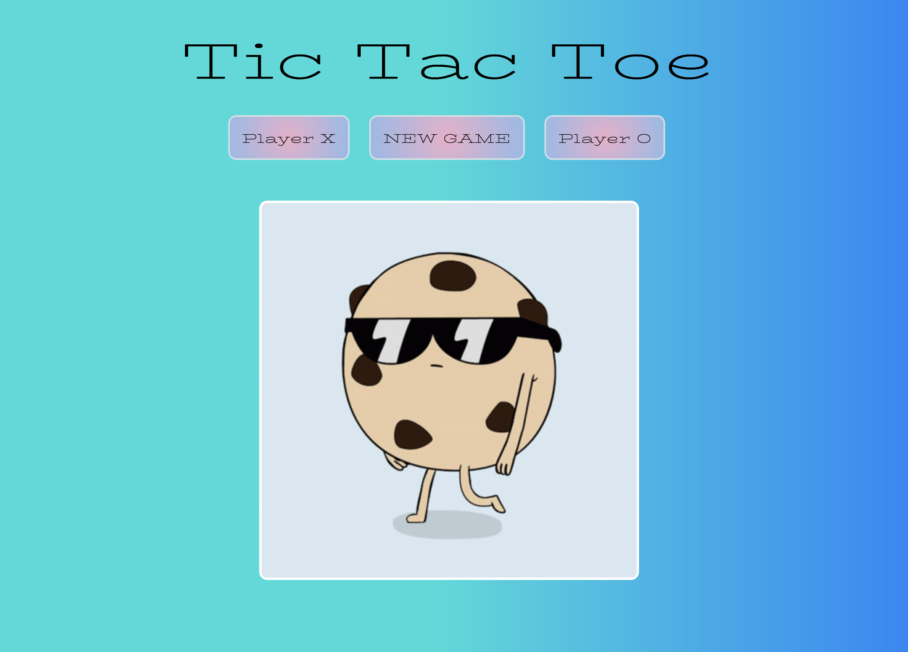

# Tic-Tac-Toe

Click the link below to check out my game! This is my first project for GA, 2 weeks into the course. Enjoy!

https://crollo1.github.io/tic-tac-toe/

<em>Tic Tac Toe</em> - simple, fun and functional.

## Instructions

1. First, click <strong>'New Game'</strong>
2. Select <em>Player X</em> or <em>Player O</em> and reveal the game board!
3. Winner will be announced with a fun feature - if it's a draw, you can try again!
4. Click New Game to reset the board.
5. Play with a rival and have a little fun :)

 

 

 

## Tech Used
* JavaScript
* jQuery
* CSS
* HTML

## Next Steps
* Add A.I feature 
* Score keeper function
* Mouse hover feature
* Further improving media query functions

